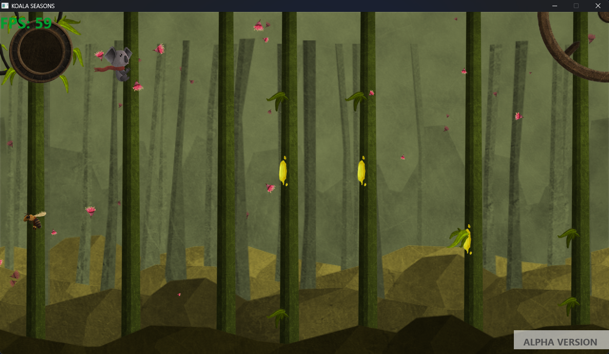
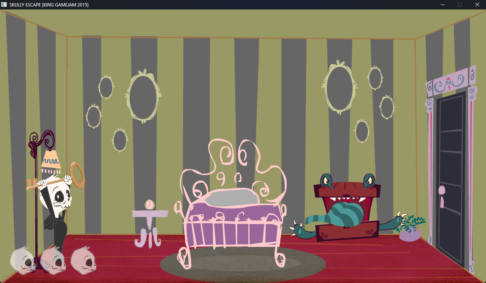
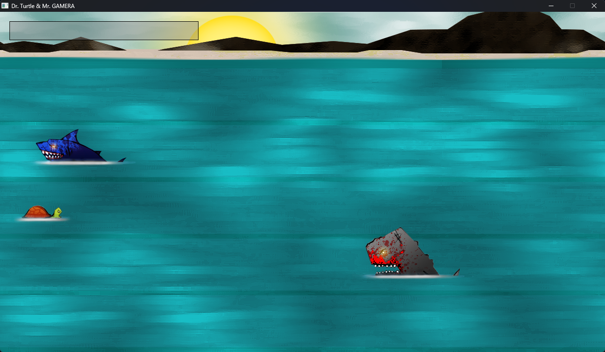
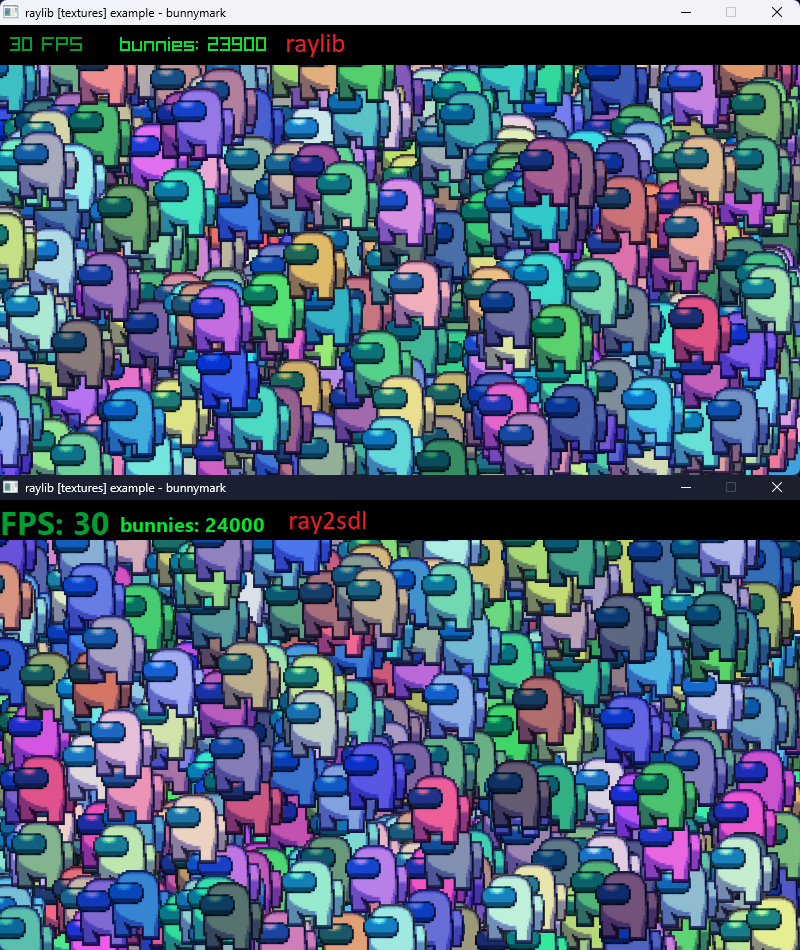

# ray2sdl
Raylib -> SDL2 Source Compability layer
## Why?
Just to test my coding skills, maybe for fun
## Performance
Maybe SDL2 is little faster than raylib, but many of functions (graphic primitives, cameras, ttf) are done softwarely.
## Screenshots
  
  
  

